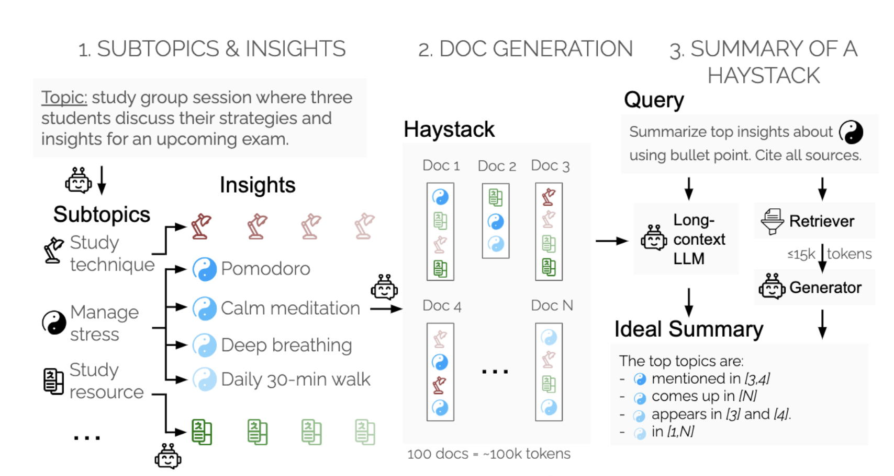

# Summary of a Haystack

This repository contains the data and code for the experiments in the [SummHay](https://arxiv.org/pdf/2407.01370) paper.

<p align="center">
  
</p>

## Table of Contents

1. [Accessing the Data](#accessing-the-data)
2. [Running the Pipeline](#running-the-pipeline)
3. [Visualizing Results on SummHay](#visualizing-results-on-summhay)
4. [Citation](#citation)
5. [Get Involved](#get-involved)


## Accessing the Data

We publicly release the 10 Haystacks (5 in conversational domain, 5 in the news domain).
You can access the Haystacks via huggingface datasets: 

```python
from datasets import load_dataset

dataset = load_dataset("Salesforce/summary-of-a-haystack")['train']
```

They are also provided in the `data/` folder. There is one Haystack per `.json` file. 

Each Haystack follows the following schema:
```
{
    "topic_id": "ObjectId()",
    "topic": "",
    "topic_metadata": {"participants": []}, // can be domain specific
    "subtopics": [
        {
            "subtopic_id": "ObjectId()",
            "subtopic_name": "",
            "subtopic": "",
            "insights": [
                {
                    "insight_id": "ObjectId()",
                    "insight_name": "",
                    "insight": ""
                }
            ],
            "query": "question reformulation of the subtopic",
            "retriever": {
                "retriever_method": {
                    "document_id": "0|1"
                }
            },
            "summaries": {
                "summarization_method_xyz": ["line1", "line2", "line3"],
                "{retriever}-{llm_summarizer}": ["line1", "line2", "line3"],
                "summarization_method_abc": ["line1", "line2", "line3"]
            },
            "eval_summaries": {
                "summarization_method_xyz": [
                    {
                        "insight_id": "",
                        "coverage": "NO_COVERAGE|PARTIAL_COVERAGE|FULL_COVERAGE",
                        "bullet_id": "line_number"
                    }
                ]
            }
        }
    ],
    "documents": [
        {
            "document_id": "ObjectId()",
            "document_text": "",
            "document_metadata": [], // domain specific information
            "insights_included": [] // list of insight_ids
        }
    ]
}
```

## Running the Pipeline

The pipeline can be run with three consecutive scripts: (1) `populate_retriever_scores.py` (optional, if implementing a new retriever), (2) `populate_summaries.py` which populates the summary outputs, (3) `populate_eval.py` which generates the evaluation scores (using GPT-4o by default.
Some notes:
- In order to introduce a new retriever/summarizer, one should modify the `generate` functions (which currently map to our internal LLM API) to link to the generative system that should be evaluated.
- We recommend keeping the prompts unmodified (they are provided in `prompts/`), but if you modify the prompt, we highly recommend stating so when reporting results. We did not perform extensive prompt engineering optimization in the results reported in the paper.
- Each script has `argparse` arguments that can help with specific use.

An example of running on the pipeline might look like:
```sh
python populate_summaries.py --fn data/topic_news1.json --domain news --model_cards claude4 --full_sum --retrieval_summ
python populate_eval.py --fn data/topic_news1.json
```

The above would run the SummHay experiment (i.e., generate summaries) for all retrievers, and for the full-context settings, for a model named Claude4 (whose access would have to be implemented within `populate_summaries.py`), followed by the automatic evaluation on those summaries.


## Visualizing Results on SummHay

The `Results_Visualization.ipynb` notebook contains the scripts that can be used to compile and visualize results, these are the exact scripts used to generate Table 2 in the paper.

## Benchmarking Automatic Evaluation

Sections 4.2-4.3 of the paper mention an experimental setup to validate the automation of SummHay evaluation.
We release the 200 annotated samples used for this experiment (see `data/eval_benchmark_data.json`), which contains the manual annotations, as well as predictions obtained from the evaluator models included in our experiments.

The `Eval_Benchmarking.ipynb` notebook includes the code used to compile and visualize the results (corresponding to Table 1 in the paper), and the bias estimates for the automatic metrics (corresponding to Table 4 in the paper's Appendix).

The release of the data can serve as a basis to evaluate future (potentially more efficient) methods for evaluation of the SummHay task.

## Citation

```
@article{laban2024SummHay,
  title={Summary of a Haystack: A Challenge to Long-Context LLMs and RAG Systems},
  author={Laban, Philippe and Fabbri, Alexander R and Xiong, Caiming and Wu, Chien-Sheng},
  journal={arXiv preprint arXiv:https://arxiv.org/pdf/2407.01370},
  year={2024}
}
```

### Get Involved

Please create a GitHub issue if you have any questions, suggestions, requests or bug-reports. 
We welcome PRs!
